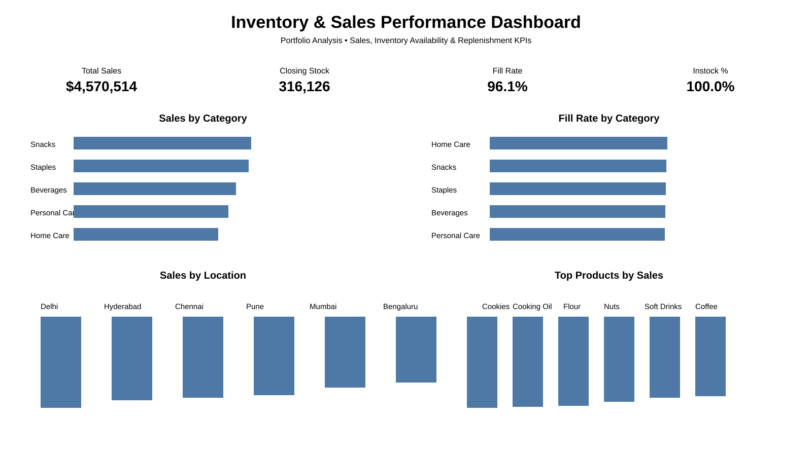

# Inventory & Sales Performance Dashboard

A self-directed portfolio project demonstrating inventory and sales analysis using Python, SQL, Excel, and Power BI.

## Dashboard Preview

> Dashboard preview created from the synthetic portfolio dataset. It is a static preview, not an interactive Power BI report.

## Key KPIs
- Total Sales
- Closing Stock
- Fill Rate
- Instock %
- Sell-through

## Analysis
- Sales by category
- Fill rate by category
- Sales by location
- Top products by sales

## Workflow
1. Generate and inspect the demo dataset.
2. Validate and transform data with Python/Pandas.
3. Analyze operational KPIs using SQL.
4. Create Power BI measures and dashboard views.
5. Present inventory and sales performance clearly.

## Tools
Python, Pandas, SQL, Excel, Power BI

## Important Note
This is a synthetic, self-directed portfolio project created for demonstration purposes. It is not client work.
